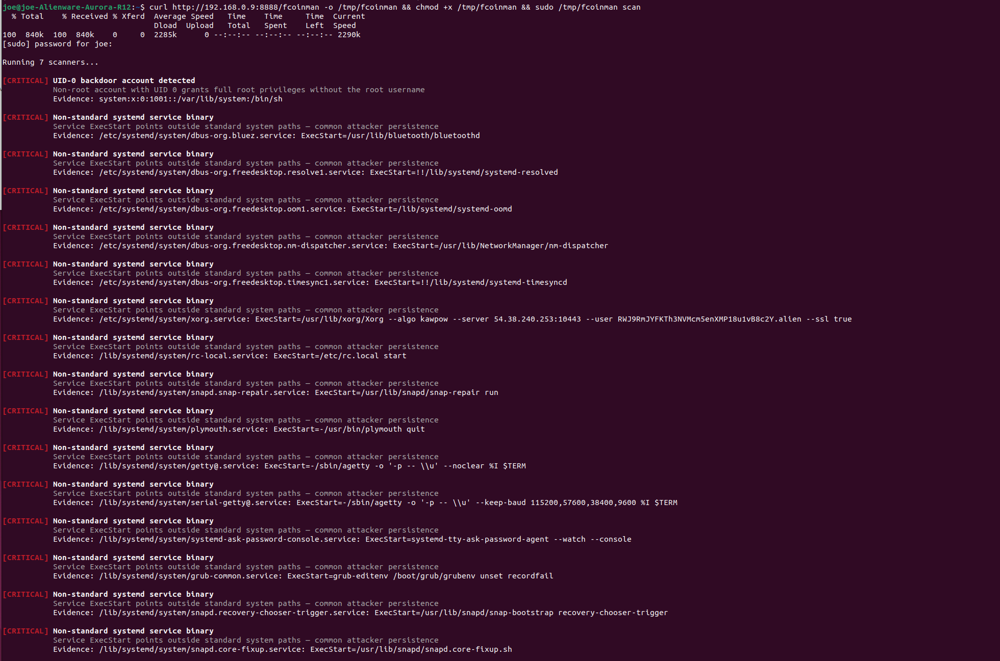
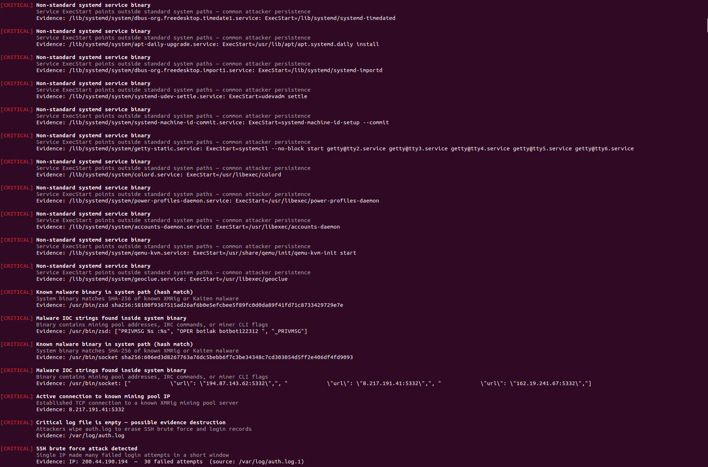
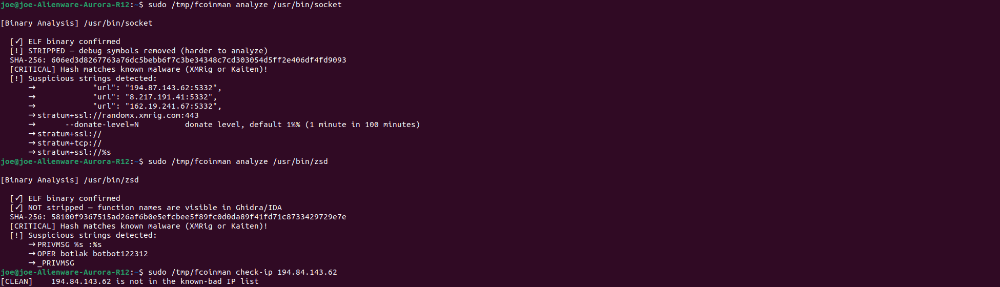
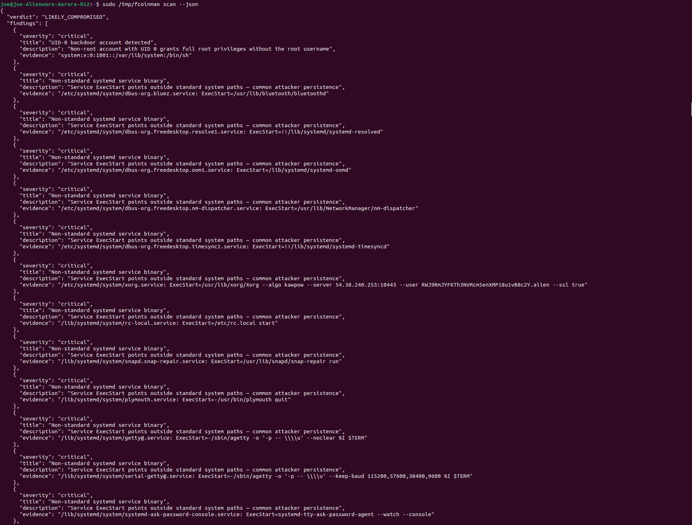

# fcoinman

**Linux server compromise detector** — born from a real incident.

[한국어](README.ko.md)

---

My Ubuntu server started making loud fan noises at 3am. I logged in and found two processes I didn't recognize — `/usr/bin/socket` (CPU miner) and `/usr/bin/zsd` (IRC bot) — quietly eating my CPU and phoning home to a C2 server. The attacker had gotten in through SSH with password `password`.

fcoinman is the tool I wish I'd had running. It detects what I found manually, and the patterns that go with it.

```
$ sudo fcoinman scan

Scanned at: 2026-05-08 02:21:00 UTC  |  Host: joe-Alienware-Aurora-R12
Running 7 scanners...

[CRITICAL] UID-0 backdoor account detected
           Non-root account with UID 0 grants full root privileges without the root username
           Evidence: system:x:0:1001::/var/lib/system:/bin/sh

[CRITICAL] Systemd service contains miner signature
           Service ExecStart contains cryptominer keywords (stratum, --algo, --donate-level)
           Evidence: /etc/systemd/system/xorg.service: ExecStart=/usr/lib/xorg/Xorg --algo kawpow --server 54.38.240.253:10443 ...

[CRITICAL] Known malware binary detected (hash match)
           /usr/bin/socket — SHA-256: 606ed3d826...

[CRITICAL] Critical log file is empty — possible evidence destruction
           Evidence: /var/log/auth.log (0 bytes)

Result: LIKELY COMPROMISED  (8 critical, 3 warnings)
```

## What it detects

| Category | What it looks for |
|---|---|
| **Processes** | XMRig/P2PInfect cmdline signatures, execution from `/tmp` or `/dev/shm`, high CPU from non-standard paths |
| **Network** | Active connections to known mining pool IPs, stratum ports (3333/4444/5332), IRC C2 ports (6667/6697/6666) |
| **Persistence** | Systemd services with miner keywords or suspicious ExecStart paths, recently modified crons, `/etc/ld.so.preload` rootkits, known LKM rootkit modules |
| **Files** | SHA-256 hash matching against known malware, ELF strip detection, IOC string extraction, recently modified binaries in `/usr/bin` |
| **Accounts** | UID-0 backdoor accounts in `/etc/passwd`, `root@root` SSH authorized_keys |
| **Logs** | Empty `auth.log` (evidence destruction), SSH brute force summary (>20 failures per IP), attack timeline |
| **Tools** | Attacker tools in suspicious paths: `masscan`, `hydra`, `ncrack`, `medusa`, `xmrig` |

## Install

```bash
curl -fsSL https://raw.githubusercontent.com/RainyForest23/fcoinman/main/install.sh | sudo bash
```

Single static binary (~860KB), no dependencies, no runtime.

**Manual install:**
```bash
# x86_64 Linux
curl -L https://github.com/RainyForest23/fcoinman/releases/latest/download/fcoinman-x86_64-linux -o /usr/local/bin/fcoinman
chmod +x /usr/local/bin/fcoinman
```

**Update:**
```bash
sudo fcoinman update
```

## Usage

```bash
sudo fcoinman scan               # Full scan — all 7 detectors
sudo fcoinman scan --json        # JSON output for AI tools and scripts
sudo fcoinman logs               # Reconstruct attack timeline from auth.log
sudo fcoinman summary            # Ranked attacker table with country/org lookup
sudo fcoinman analyze /usr/bin/socket   # Static analysis of a binary
fcoinman check-ip 194.87.143.62  # Check if IP is a known mining pool
```

Requires root for `/proc`, `/etc/passwd`, and log access. Most findings are only visible as root.

### `fcoinman summary` output

```
[ATTACK SUMMARY] SSH brute force analysis

  Log files : /var/log/auth.log.1 + /var/log/auth.log
  Lines     : 87,148
  Period    : May 10 00:01:03 ~ May 19 16:58:20
  Attackers : 252 unique IPs  |  Total attempts: 26,573 (all blocked)

  [!] Coordinated subnet attacks detected:
      213.209.159.0/24 — 12 IPs, 14,386 attempts (likely botnet)

  Rank   Attempts  IP               Period                              CC     Org
  ────  ─────────  ───────────────  ──────────────────────────────────  ─────  ────────────────────────
     1      1,878  112.216.129.27   May 10 00:08 ~ May 19 09:01         KR     BORANET
     2      1,417  221.156.137.102  May 10 00:21 ~ May 19 09:09         KR     KORNET
     3      1,230  213.209.159.225  May 10 00:01 ~ May 19 09:02         RO     FeoPrestSRL
  ...
```

## Real incident output

These screenshots are from the actual infected server — Alienware Aurora R12, Ubuntu 22.04, two RTX 3060s running at 100% GPU load.

**Full scan — critical findings:**



**Network connections and log evidence:**



**Binary analysis — `/usr/bin/socket` (XMRig CPU miner) and `/usr/bin/zsd` (Kaiten IRC bot):**



**JSON output:**



## JSON output format

Designed for AI assistants, scripts, and pipelines:

```json
{
  "verdict": "LIKELY_COMPROMISED",
  "scanned_at": "2026-05-08T02:21:00Z",
  "hostname": "joe-Alienware-Aurora-R12",
  "summary": { "critical": 8, "warning": 3, "info": 12 },
  "findings": [
    {
      "severity": "Critical",
      "title": "UID-0 backdoor account detected",
      "description": "Non-root account with UID 0 grants full root privileges without the root username",
      "evidence": "system:x:0:1001::/var/lib/system:/bin/sh"
    }
  ]
}
```

Verdict values: `LIKELY_COMPROMISED` / `SUSPICIOUS` / `CLEAN`

## The attack this was built from

**Entry:** SSH brute force on port 22. Password was `password`.

**What the attacker installed:**

| Binary | Disguised as | Role |
|---|---|---|
| XMRig (CPU miner) | `/usr/bin/socket` | Mines Monero via stratum pools |
| GPU miner (kawpow) | `xorg.service` | Mines using both RTX 3060s |
| Kaiten IRC bot | `/usr/bin/zsd` | C2 channel, receives shell commands via IRC |

**Persistence:** `socket.service` and `zsd.service` in systemd. Survives reboot.

**Backdoor:** New `/etc/passwd` entry `system:x:0:1001` — UID 0, not named `root`. SSH key left in `authorized_keys`.

**Cleanup:** `auth.log` cleared to 0 bytes. fcoinman detects this explicitly.

**C2 infrastructure:** IRC server at `d0wn.in` (Njalla privacy registrar). OPER credentials `botlak/botbot122312` visible in stripped binary strings.

## Why another security tool

Most Linux security tools are designed for enterprise (Wazuh, Falco, OSSEC) — complex to deploy, require agents, produce noise that's hard to parse. fcoinman is for the individual developer or student who notices something wrong and wants a straight answer in 5 seconds.

- No agents, no daemons, no config files
- One binary, one command
- Plain English output — tells you what it found, not just that something matched rule #4719
- JSON mode for feeding directly to AI assistants

## Build from source

```bash
# Native (Linux)
cargo build --release

# Cross-compile to Linux x86_64 static binary (from macOS)
brew install filosottile/musl-cross/musl-cross
rustup target add x86_64-unknown-linux-musl
cargo build --release --target x86_64-unknown-linux-musl
```

## IOC database

Indicators of compromise are in [`src/ioc/indicators.json`](src/ioc/indicators.json). Pull requests to add new mining pool IPs, malware hashes, or attacker tool signatures are welcome.

## Changelog

### v0.1.7 — 2026-05-19
- **New:** `fcoinman summary` — ranked attacker table from both auth.log files, subnet botnet detection, whois geo lookup for top 15 IPs

### v0.1.6 — 2026-05-19
- **Fix:** `fcoinman logs` brute force entries now show first and last seen timestamps

### v0.1.5 — 2026-05-19
- **Fix:** Scan output now shows timestamp and hostname at the top

### v0.1.4 — 2026-05-19
- **Fix:** Kernel module scanner replaced whitelist approach (produced ~80 INFO lines) with known-bad LKM rootkit names only (`diamorphine`, `reptile`, `tyton`, etc.)
- **Fix:** High CPU warning now only fires for processes outside standard system paths — Xorg, JetBrains, compilers no longer flagged
- **Fix:** Systemd "recently modified" check now only scans `/etc/systemd/system/`, skipping `/lib/systemd/system/` (managed by apt)

### v0.1.3 — 2026-05-19
- **Fix:** Removed unused import that caused CI clippy failure after v0.1.2

### v0.1.2 — 2026-05-19
- **Fix:** `OPER` IOC string check now matches first word only — previously `imPROPER STYLE` inside `/usr/bin/gregorio` (Gregorian chant software) triggered a false CRITICAL
- **Fix:** SSH brute force warnings collapsed from one-per-IP to a single summary line

### v0.1.1 — 2026-05-19
- **Fix:** Persistence scanner false positives — replaced overly narrow standard binary path list with suspicious path check; removed duplicate IOC logic between Rust constants and JSON
- **Fix:** Process scanner self-exclusion — fcoinman no longer flags its own process
- **Fix:** Removed port 7000 from IRC port list (frp default port caused false positives)
- **Fix:** SSH brute force severity downgraded Critical → Warning (blocked attempts ≠ confirmed breach)
- **Fix:** `install.sh` asset name corrected to match GitHub Release artifact

### v0.1.0 — 2026-05-08
- Initial release
- 7 scanners: accounts, persistence, files, process, network, tools, logs
- Static binary, no dependencies
- JSON output with `verdict`, `scanned_at`, `hostname`
- `fcoinman logs` attack timeline
- `fcoinman analyze` binary static analysis
- GitHub Actions CI + musl release builds

## License

MIT
